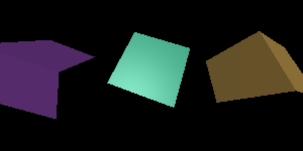

# ThreeJS Demo (TypeScript)

A simple demo of the ThreeJS 3D library using TypeScript.

## Introduction

ThreeJS is a 3D library that tries to make it as easy as possible to get 3D content on a webpage.




## Installation

```bash
git clone https://github.com/kgish/threejs-demo.git
cd threejs-demo
yarn
```

## Run

```bash
yarn dev
```

Point your favorite browser to `http://localhost:1234` and enjoy!

## Build

```bash
yarn build
```

## Lint

```bash
yarn lint
```

## Test

```bash
yarn test
```

## References

* [ThreeJS](https://threejs.org)
* [Fundamentals](https://threejs.org/manual/#en/fundamentals)
* [Parcel](https://parceljs.org)
* [TypeScript](https://www.typescriptlang.org)
* [EsLint](https://eslint.org)
* [Stylelint](https://stylelint.io)
